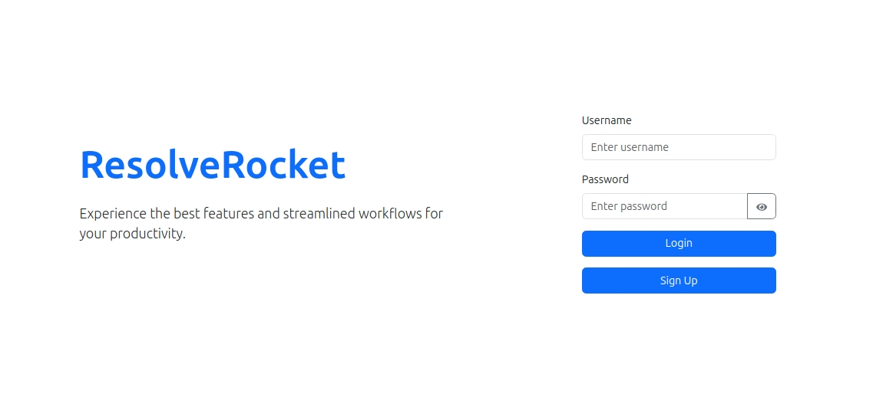

# ResolveRocket


---

ResolveRocket is a web application that serves as a maintenance issues tracking system.<br> It allows users to report issues, view their status and progress, and receive updates from the maintenance team. <br>It also enables the maintenance officer to assign issues to<br>technicians, monitor their resolution, and close them when they are done.<br>It also provides dashboards for each role to access and manage their tasks and data.

## Installation and Usage

To install and run ResolveRocket, you need to have Node.js, React and MongoDB installed on your machine. \You also need to clone the repository from GitHub:

```bash
git clone `https://github.com/JeremyWarui/service_desk.git`
```

Then, you need to install the dependencies for both the backend and the frontend:

```bash

cd /backend
npm install
cd /frontend
npm install
```

Next, you need to create a `.env` file in the backend directory and add the following environment variables:

```bash
PORT=5000 # the port number for the backend server
DATABASE_URI=mongodb://localhost:27017/service_desk # the connection string for the MongoDB database
TOKEN_SECRET=your_secret_key # the secret key for generating JSON Web Tokens
TOKEN_EXPIRE=NO_SECONDS
```

Finally, you can start the backend and the frontend servers by running the following commands in separate terminals:

### start the backend server

```bash
cd backend
npm run start-server
```

### start the frontend server

```bash
cd frontend
npm start
```

The backend server will run on `http://localhost:5000` and the frontend server will run on `http://localhost:3000`.

To use ResolveRocket, you can register as a user, a maintenance officer, or a technician, and log in with your credentials. Depending on your role, you will be able to access different dashboards and features:

**Users dashboard**:

- Users can report issues
- View their status and progress
- Receive updates from the maintenance team.

Pages:

- Reporting: `/users-dashboard/report-issue`
- View user's issues: `/users-dashboard/my-issues`
- View all issues posted: `/users-dashboard/all-issues`
- View and update issues: `/users-dashboard/my-issues/:id`

**Maintenance dashboard**:

- Maintenance officers can view all the issues
- Assign them to technicians,
- Monitor their resolution
- Close them when they are done.

Pages:

- View all issues: `/maintenance-dashboard/all-issues`
- Assign issues: `maintenance-dashboard/assignments`
... as the dashboard higlights in the navigation

**Technicians dashboard**:

- Technicians can view their assigned issues
- Update their status and progress
- Resolve them.

Pages:
...as directed by navigation bar

## Technologies and Tools

ResolveRocket is built using the following technologies and tools:

**Backend**: Node.js, Express, MongoDB, Mongoose, JWT, bcrypt, dotenv, cors, nodemon

**Frontend**: React, React Router, Bootstrap, Axios

## Contribution and License

ResolveRocket is an open-source project that welcomes contributions from other developers. \If you want to contribute to ResolveRocket please follow these steps:

- Fork the repository on GitHub
- Create a new branch from the main branch
- Make your changes and commit them with descriptive messages
- Push your branch to your forked repository
- Create a pull request from your branch to the main branch of the original repository
- Wait for the review and feedback from the maintainers

## More work to be done

1. Deployment of the application

2. Report generation

3. Documentation for the API resources

## Acknowledgment

I appreciate alot the ALX community and Cohort 11 for the encouragement and support and opportunity to \learn and build skills that have led me to build such an application. We can do hard things

## Authors and Contributors

ResolveRocket is developed and maintained by Jeremy Warui. You can contact him at <jmwangi0x01@gmail.com>.
